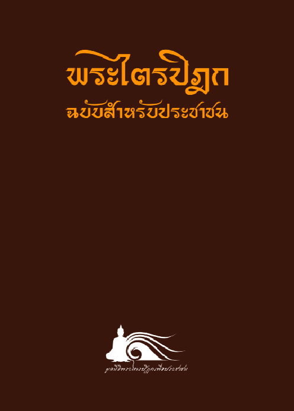

# **พระไตรปิฎก**{.text-center}
## ฉบับสำหรับประชาชน{.text-center}

##### ย่อความจากพระไตรปิฎกฉบับภาษาบาลี ๔๕{.text-center .py-2}
##### สุชีพ  ปุญญานุภาพ{.text-center .py-4}

    

        
        
    

    

            การจัดพิมพ์พระไตรปิฎกฉบับสำหรับประชาชน มีวัตถุประสงค์ให้เป็นสมบัติสำหรับประชาชนให้มากที่สุด เพราะพระไตรปิฎกนั้น มีข้อความพิสดารมาก มีถึง 45 เล่มขนาดใหญ่ แม้แต่ผู้รู้ภาษาบาลีเองก็หาตัวผู้อ่านจบได้ยาก ถ้าใช้วิธีย่อความให้ได้สาระสำคัญไว้ให้ครบทุกเล่ม ก็จะเหมือนได้อ่านเองจบเล่มใหญ่ แลัวตัดลัดเก็บใจความที่สำคัญไว้ได้

            การจัดทำพระไตรปิฎกฉบับประชาชนขึ้นนี้ เนื่องมาจากความปรารถนาที่จะได้เห็นพี่น้องพุทธศาสนิกชนชาวไทยได้อ่านพระไตรปิฎกจบ โดยได้ประโยชน์ในขณะเดียวกัน 4 ประการ คือ

            * รู้ความหมาย และความเป็นมาแห่งพระไตรปิฎกตั้งแต่ต้นจนได้พิมพ์ขึ้นเป็นอักษรไทย พร้อมทั้งวิธีการจัดหมวดหมู่ในพระไตรปิฎกอย่างชัดเจน
            * รู้เรื่องที่น่าสนใจ ซึ่งได้เลือกนำมาแปลไว้เป็นตอน ๆ เพื่อให้เป็นแนวคำสอนทางพระพุทธศาสนาทั้งสามปิฎก
            * รู้ความย่อในพระไตรปิฎกแต่ละเล่ม ทั้งหมด 45 เล่ม เป็นการย่อที่พยายามให้ได้สาระสำคัญ
            * ได้อ่านเอกสารทางประวัติศาสตร์ของไทย เพื่อทราบความเป็นมาแห่งพระไตรปิฎกในประเทศไทย เป็นเอกสารซึ่งรวบรวมไว้เพื่อให้ค้นได้สะดวก ไม่กระจัดกระจาย

            เหตุผลที่ตั้งชื่อว่าพระไตรปิฎกฉบับสำหรับประชาชน ก็ด้วยต้องการทำงานชิ้นนี้ให้เป็นสมบัติสำหรับประชาชนให้มากที่สุด เพราะพระไตรปิฎกนั้น มีข้อความพิสดารมาก มีถึง ๔๕ เล่มขนาดใหญ่ แม้แต่ผู้รู้ภาษาบาลีเองก็หาตัวผู้อ่านจบได้ยาก ถ้าใช้วิธีย่อความให้ได้สาระสำคัญไว้ให้ครบทุกเล่ม ก็จะเหมือนได้อ่านเองจบเล่มใหญ่ แลัวตัดลัดเก็บใจความที่สำคัญไว้ได้
    
    

