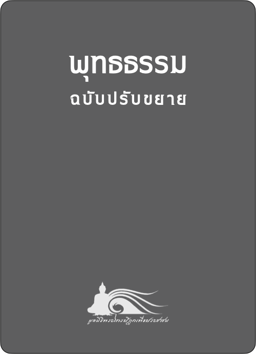

# **พุทธธรรม**{.text-center}
## ฉบับปรับขยาย{.text-center}

##### สมเด็จพระพุทธโฆษาจารย์ {.text-center .py-2}
##### ป. อ. ปยุตฺโต{.text-center .py-4}

[{.rounded .mx-auto .d-block}](/../bd)

 

###### [อ่านพุทธธรรม ](/../bd){.text-center}

 

พุทธธรรมเป็นการประมวลคำสอนในพระพุทธศาสนา มุ่งหมายแสดงแนวทางสำหรับประพฤติปฏิบัติในชีวิตจริง พุทธธรรมมีลักษณะทั่วไป ๒ ประการ คือ

1. แสดงหลักความจริงสายกลาง ที่เรียกว่า “มัชเฌนธรรม” หรือเรียกเต็มว่า “มัชเฌนธรรมเทศนา” ว่าด้วยความจริงตามแนวของเหตุผลบริสุทธิ์ตามกระบวนการของธรรมชาติ นำมาแสดงเพื่อประโยชน์ในทางปฏิบัติในชีวิตจริงเท่านั้น ไม่ส่งเสริมความพยายามที่จะเข้าถึงด้วยวิธีถกเถียงสร้างทฤษฎีต่างๆ ขึ้นแล้วยึดมั่นปกป้องทฤษฎีนั้นๆ ด้วยการเก็งความจริงทางปรัชญา
2. แสดงข้อปฏิบัติสายกลาง ที่เรียกว่า “มัชฌิมาปฏิปทา” อันเป็นหลักการครองชีวิตของผู้ฝึกอบรมตน ผู้รู้เท่าทันชีวิต ไม่หลงงมงาย มุ่งผลสำเร็จคือ ความสุข สะอาด สว่าง สงบ เป็น ที่สามารถมองเห็นได้ในชีวิตนี้ ในทางปฏิบัติ ความเป็นสายกลางนี้เป็นไปโดยกับองค์ประกอบอื่นๆ เช่น สภาพชีวิตของ หรือ เป็นต้น

พุทธธรรมยังแสดงแยกออกเป็น ๒ ส่วน คือ สัจธรรม ส่วนหนึ่ง กับ จริยธรรม ส่วนหนึ่ง โดยกำหนดให้สัจธรรมเป็นส่วนแสดงสภาวะหรือรูปลักษณะตัวจริง และให้จริยธรรมเป็นฝ่ายข้อประพฤติปฏิบัติทั้งหมด ก็จะเห็นว่าสัจธรรมในพุทธศาสนา ย่อมหมายถึงคำสอนเกี่ยวกับสภาวะของสิ่งทั้งหลาย หรือและความเป็นไปโดยธรรมดาของสิ่งทั้งหลาย หรือกฎธรรมชาตินั่นเอง ส่วนจริยธรรม ก็หมายถึงการถือเอาประโยชน์จากความรู้ความเข้าใจในสภาพและความเป็นไปของสิ่งทั้งหลาย หรือการรู้กฎธรรมชาติแล้วนำมาใช้ในทางที่เป็นประโยชน์ อีกนัยหนึ่ง สัจธรรม คือธรรมชาติและกฎธรรมดา จริยธรรมคือความรู้ในการประยุกต์สัจธรรม

ด้วยเหตุนี้ ในการแสดงพุทธธรรมเพื่อความรู้ความเข้าใจที่มุ่งในแนวทฤษฎี คือ มุ่งให้รู้ว่าอะไรเป็นอะไร มีขอบเขตแค่ไหนเพียงไร จึงควรแสดงควบคู่กันไปทั้งสัจธรรมและจริยธรรม คือแสดงหลักคำสอนในแง่สภาวะ แล้วชี้ถึงคุณค่าที่จะนำมาใช้ในทางปฏิบัติไว้ด้วยให้เสร็จไปแต่ละอย่างๆ ...
