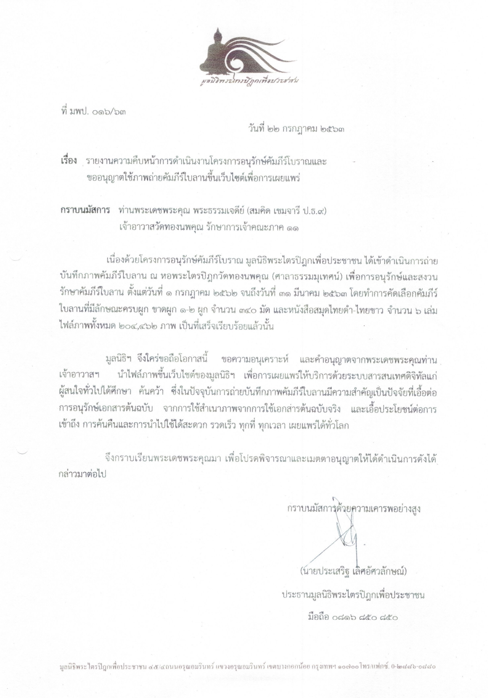

#### เกี่ยวกับวัด

วัดทองนพคุณ เป็นพระอารามหลวงชั้นตรี ชนิดสามัญ สังกัดมหานิกาย ตั้งอยู่เลขที่ 103 ถ.สมเด็จเจ้าพระยา ซ. 17 เขตคลองสาน กรุงเทพ ฯ มีเนื้อที่ตั้งวัด 20 ไร่ 3 งาน  67 ตารางวา

วัดทองนพคุณ แปลว่า "พระคุณ 9 ประการ ของพระพุทธเจ้า" ไม่ปรากฏหลักฐานการสร้าง แต่สันนิษฐานว่า น่าจะอยู่ในสมัยกรุงศรีอยุธยาตอนกลาง เนื่องจากค้นพบคัมภีร์ใบลานเก่า ชื่อปาฏิกวรรค ทีฆนิกาย จารด้วยอักษรขอม สร้างเมื่อ พ.ศ. 2166 ซึ่งตรงกับรัชสมัยพระมหาธรรมิกธิราชเจ้า หรือพระเจ้าทรงธรรม ได้ถูกเก็บรักษาไว้

#### คัมภีร์โบราณ

เนื่องสำนักหอสมุดแห่งชาติได้การดำเนินการสำรวจคัมภีร์โบราณ ที่เก็บรักษาไว้ในวัดทองนพคุณ และจัดทำทะเบียนคัมภีร์ขึ้น เพื่อวัตถุประสงค์ในการอนุรักษ์คัมภีร์ให้มีอายุยาวนาน และสะดวกต่อการศึกษาค้นคว้า 

จากการสำรวจได้พบว่า มีพระคัมภีร์ที่สามารถระบุยุคและปีที่สร้าง ย้อนกลับไปถึง พ.ศ. 2166 ซึ่งตรงกับรัชสมัยของพระเจ้าทรงธรรม แห่งกรุงศรีอยุธยา จึงมีความน่าสนใจ และเป็นหลักฐานสำคัญต่อการค้นคว้าในทางพระพุทธศาสนาอย่างยิ่ง

#### ตัวอย่างคัมภีร์ที่เก่าแก่ อายุเกิน 200 ปี

| ลำดับ               | เรื่อง                        | ปีสร้าง        | สมัย             |
| ---------------- | --------------------- |------------ |--------------  |
|  [วท. 172  ](/dpwt)     | ปาฏิกวัคค ทีฆนิกาย  | พ.ศ. 2166 | กรุงศรีอยุธยา |
|  [เลขที่ 388 ](/dpwt)   | พระเวสันดรชาดก     | พ.ศ. 2238 | กรุงศรีอยุธยา |
|  [เลขที่ 867](/dpwt)    | โลกนยชาดก            | พ.ศ. 2261 | กรุงศรีอยุธยา |

#### การดำเนินการอนุรักษ์

หลังจากทำการสำรวจรวบรวม และจัดทำทะเบียนคัมภีร์ โดยสำนักหอสมุดแห่งชาติได้สำเร็จลง เมื่อปี พ.ศ. 2559 ต่อมา มูลนิธิพระไตรปิฎกเพื่อประชาชน ได้เล็งเห็นประโยชน์ในการอนุรักษ์ และเผยแพร่คัมภีร์เหล่านั้น โดยเฉพาะคัมภีร์ทางพระพุทธศาสนา จึงจัดทำ**โครงการอนุรักษ์และเผยแพร่คัมภีร์โบราณ**ขึ้น นำเทคโนโลยีสารสนเทศมาประยุกต์ใช้ในการอนุรักษ์ ดำเนินการถ่ายบันทึกภาพคัมภีร์ต่าง ๆ  ด้วยระบบดิจิทัล และเผยแพร่ให้บริการผ่านเครือข่ายอินเตอร์เน็ต แก่ผู้สนใจทั่วไปได้ศึกษา คันคว้า ซึ่งจะเอื้อต่อการอนุรักษ์เอกสารต้นฉบ้บ ลดโอกาสต่อการชำรุดเสียหาย และสามารถเข้าถึง ทำการค้นคว้าได้สะดวก รวดเร็ว ทุกที่ ทุกเวลา

การดำเนินโครงการฯ สำเร็จลงในเดือนมีนาคม พ.ศ. 2563 ใช้เวลาทั้งสิ้นกว่า 8 เดือน และได้รับการอนุญาติจากทางวัด ให้สามารถใช้ภาพถ่ายคัมภีร์โบราณ สำหรับการเผยแพร่สู่สาธารณะต่อไป

#### เอกสารแนบ

##### จดหมาย ขออนุญาติใช้ภาพถ่ายคัมภีร์ใบลานเพื่อการเผยแพร่{.tc}
##### มูลนิธิพระไตรปิฎกเพื่อประชาชน{.tc}
##### ที่ มปพ. ๐๑๖/๖๓{.tc .mt-20}

{.ba}

##### จดหมาย อนุญาติให้ใช้ภาพถ่ายคัมภีร์ใบลานเพื่อการเผยแพร่{.tc}
##### วัดทองนพคุณ{.tc}
##### ที่ วน. ๐๖๓/๒๕๖๓{.tc .mt-20}

{.ba}
